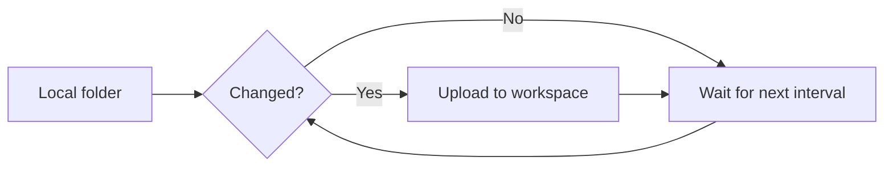
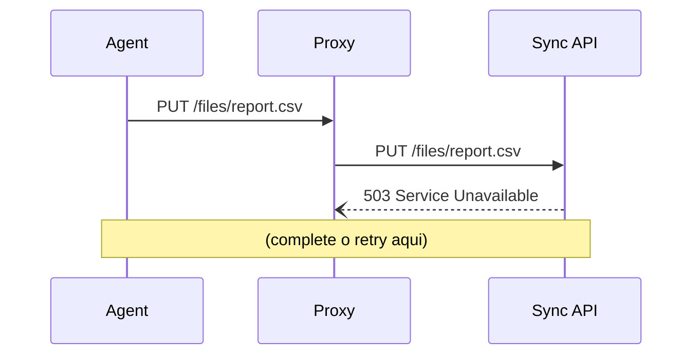

# Módulo 11 — Recursos avançados

> **Objetivo:** conhecer busca, diagramas, versionamento e tradução — e saber
> quando cada um vale a pena.
> **Tempo:** ~60 min
> **Pré-requisito:** [Módulo 10](./10-blog-and-pages.md)

Este módulo é um cardápio, não uma receita. Faça os Passos 1 e 2 (busca e
diagramas) sempre; os outros, conforme a necessidade aparecer — e o objetivo
deles é justamente você saber **quando não** usar.

💻 Dentro de `website`.

---

## Passo 1 — Busca

O Docusaurus **não vem com busca**. Para documentação com mais de 10 páginas, é a
primeira coisa que falta.

A documentação oficial lista quatro caminhos: Algolia DocSearch (o único
oficial), Typesense, busca local e um componente próprio. Os três últimos são
mantidos pela comunidade.

### Opção A — Busca local

O índice é gerado no build e roda inteiro no navegador. Nenhum dado sai da
máquina de quem lê. É o caminho para site interno, intranet, ou qualquer coisa
que não possa ser rastreada de fora.

💻

```powershell
npm install @easyops-cn/docusaurus-search-local
```

📄 Em `docusaurus.config.js`, no **nível raiz** do objeto de config — irmão de
`presets` e `themeConfig`, não dentro deles:

```js
themes: [
  [
    '@easyops-cn/docusaurus-search-local',
    {
      hashed: true,
      language: ['en'],
      indexDocs: true,
      indexBlog: true,
      indexPages: true,
      highlightSearchTermsOnTargetPage: true,
    },
  ],
],
```

⚠️ **A busca local só funciona no site buildado.** No `npm start` ela não
aparece, e você fica achando que a instalação falhou. Para testar:

```powershell
npm run build
npm run serve
```

👀 Uma caixa de busca surge na navbar. Digite uma palavra que só existe numa
página específica — "keychain", por exemplo — e veja o resultado com destaque.

⚠️ Como é um plugin da comunidade, ele pode demorar a acompanhar uma versão nova
do Docusaurus. Antes de atualizar o Docusaurus, confira se a versão dele já saiu.
Isso vale para qualquer plugin fora do `@docusaurus/*`.

### Opção B — Algolia DocSearch

Gratuito para projetos públicos e open source, e é a opção oficial. O Algolia
rastreia seu site e hospeda o índice. Melhor qualidade de resultado, mas exige
que o site seja público e depende de um serviço externo.

Peça acesso em [docsearch.algolia.com](https://docsearch.algolia.com/) e
configure:

```js
themeConfig: {
  algolia: {
    appId: 'YOUR_APP_ID',
    apiKey: 'YOUR_SEARCH_ONLY_API_KEY',
    indexName: 'your-index',
    contextualSearch: true,
  },
},
```

⚠️ A `apiKey` aqui é a **search-only**, que é pública por natureza — ela vai para
o HTML do site. Se você colar a chave de administração por engano, qualquer
visitante pode apagar seu índice.

**Para documentação corporativa interna, use a opção A.** Para um site público
que você quer que apareça bem, a B.

---

## Passo 2 — Diagramas com Mermaid

Diagramas escritos como texto, versionados junto com o conteúdo.

💻

```powershell
npm install @docusaurus/theme-mermaid
```

📄 No `docusaurus.config.js`:

```js
markdown: {
  mermaid: true,
},
themes: ['@docusaurus/theme-mermaid'],
```

⚠️ Se você já tem um `themes: [...]` (da busca), **some os dois num array só**.
Duas chaves `themes` no mesmo objeto: a segunda apaga a primeira, sem erro e sem
aviso.

```js
themes: [
  '@docusaurus/theme-mermaid',
  [
    '@easyops-cn/docusaurus-search-local',
    {/* ... */},
  ],
],
```

💻 Reinicie o `npm start`.

📄 Depois, em qualquer página:

````mdx

````

👀 O diagrama é renderizado, e **acompanha o modo claro/escuro** sozinho.

Outros tipos úteis: `sequenceDiagram` (fluxo entre sistemas), `gantt`
(cronograma), `erDiagram` (modelo de dados), `stateDiagram-v2` (máquina de
estados). A sintaxe está em [mermaid.js.org](https://mermaid.js.org/).

A vantagem sobre uma imagem: dá para revisar a mudança num diff do Git, e o
diagrama nunca fica desatualizado numa pasta separada. A desvantagem: controle
fino de layout é limitado — para um diagrama que precisa ficar exatamente de um
jeito, uma imagem ainda ganha.

---

## Passo 3 — Versionamento

Permite manter a documentação da versão 1.0 no ar enquanto você escreve a 2.0.

💻

```powershell
npm run docusaurus docs:version 1.0
```

👀 Foi criado:

```
versioned_docs/version-1.0/     ← cópia congelada de docs/
versioned_sidebars/             ← cópia da sidebar
versions.json                   ← ["1.0"]
```

A partir de agora: `docs/` é a versão em desenvolvimento ("Next"), e
`versioned_docs/version-1.0/` é a 1.0, congelada.

📄 Adicione o seletor na navbar:

```js
{type: 'docsVersionDropdown', position: 'right'},
```

📄 E configure qual versão é a padrão:

```js
docs: {
  lastVersion: '1.0',
  versions: {
    current: {label: '2.0 (in development)', path: 'next'},
    '1.0': {label: '1.0 (stable)'},
  },
},
```

⚠️ **Pense antes de versionar.** Cada versão é uma cópia completa da pasta
`docs/`. Uma correção de erro de digitação que valha para todas as versões
precisa ser feita em todas as pastas — e ninguém faz. Na prática, as versões
antigas apodrecem.

Só versione quando pessoas realmente usam versões antigas do produto ao mesmo
tempo, e quando alguém tem o trabalho de manter as duas.

💻 Para este guia, **desfaça**:

```powershell
Remove-Item -Recurse -Force versioned_docs, versioned_sidebars, versions.json
```

E remova o `docsVersionDropdown` e o bloco `versions` do config.

---

## Passo 4 — Tradução (i18n)

📄 Declare os idiomas:

```js
i18n: {
  defaultLocale: 'en',
  locales: ['en', 'pt-BR'],
  localeConfigs: {
    en: {label: 'English'},
    'pt-BR': {label: 'Português'},
  },
},
```

💻 Gere os arquivos de tradução **da interface** (os rótulos do tema: "Next",
"Edit this page", "On this page"):

```powershell
npm run write-translations -- --locale pt-BR
```

👀 Aparece `i18n/pt-BR/` com JSONs para você traduzir.

O conteúdo em si é traduzido copiando os arquivos para a estrutura espelhada:

```
i18n/pt-BR/docusaurus-plugin-content-docs/current/installation.mdx
```

💻 Para trabalhar num idioma:

```powershell
npm start -- --locale pt-BR
```

📄 E o seletor na navbar:

```js
{type: 'localeDropdown', position: 'right'},
```

⚠️ **Mesmo alerta do versionamento, elevado.** Traduzir dobra o trabalho de
manutenção para sempre, e uma tradução desatualizada é pior que nenhuma —
o leitor confia e é enganado. Combine i18n com versionamento e você tem 4 cópias
de cada página.

⚠️ E note a assimetria com este guia: o **site** é em inglês, o **guia** é em
português. Isso é de propósito e não é i18n — são conteúdos diferentes, não
traduções um do outro. i18n é para quando a *mesma* página existe em dois
idiomas.

---

## Passo 5 — Plugins úteis

Plugins adicionam funcionalidade ao site. Alguns que valem conhecer:

| Plugin | Para quê |
|---|---|
| `@docusaurus/plugin-client-redirects` | Redireciona URLs antigas para novas |
| `@docusaurus/plugin-ideal-image` | Otimiza imagens e carrega sob demanda |
| `@docusaurus/theme-live-codeblock` | Blocos de código executáveis na página |
| `docusaurus-plugin-openapi-docs` | Gera documentação a partir de um OpenAPI |

O primeiro é indispensável assim que você reorganiza a documentação uma vez:

💻

```powershell
npm install @docusaurus/plugin-client-redirects
```

```js
plugins: [
  [
    '@docusaurus/plugin-client-redirects',
    {
      redirects: [
        {from: '/docs/intro', to: '/docs/'},
      ],
    },
  ],
],
```

Esse redirect específico resolve um problema real do seu site: no Módulo 03 você
deu `slug: /` para o `intro.mdx`, e qualquer link antigo para `/docs/intro`
morreu. Agora ele volta a funcionar.

⚠️ Este plugin só age no **build**. No `npm start` ele não faz nada — mesma
pegadinha da busca local.

---

## Passo 6 — Múltiplas instâncias de docs

Para separar conteúdos que não se misturam (ex.: "Guide" e "API"), com URLs e
versionamento independentes:

```js
plugins: [
  [
    '@docusaurus/plugin-content-docs',
    {
      id: 'api',
      path: 'api',                 // a pasta api/ na raiz de website/
      routeBasePath: 'api',        // URLs em /api/...
      sidebarPath: './sidebars-api.js',
    },
  ],
],
```

E na navbar: `{type: 'docSidebar', docsPluginId: 'api', sidebarId: 'apiSidebar'}`.

> **Instância separada ou só uma sidebar a mais?** Se os dois conteúdos versionam
> juntos e compartilham links, uma segunda sidebar (Módulo 07, Passo 6) resolve e
> é muito mais simples. Instância separada é para quando eles têm ciclos de vida
> diferentes.

---

## Passo 7 — Código executando no navegador

Às vezes você precisa rodar um script em todas as páginas (analytics interno,
ajuste de comportamento). Use um *client module*:

📄 Crie `src/clientModules/analytics.js`:

```js
export function onRouteDidUpdate({location}) {
  console.log('Navigated to:', location.pathname);
}
```

```js
clientModules: ['./src/clientModules/analytics.js'],
```

⚠️ Esse código roda **no navegador**, não no build. Se você tentar usar `window`
ou `document` fora de um client module — direto num componente, por exemplo — o
build quebra com:

```
ReferenceError: window is not defined
```

Porque o Docusaurus renderiza as páginas no Node durante o build, e lá `window`
não existe. É a diferença entre gerar o HTML e executá-lo.

A solução padrão para componentes:

```jsx
import BrowserOnly from '@docusaurus/BrowserOnly';

<BrowserOnly>{() => <ComponentThatUsesWindow />}</BrowserOnly>
```

Repare que o filho é uma **função**, não um elemento. É o que adia a execução
para depois de o navegador assumir.

---

## Passo 8 — Registrar no Git

💻

```powershell
cd ..
git add .
git commit -m "feat: add local search, Mermaid diagrams and URL redirects"
git push
cd website
```

---

## ✅ Checkpoint

- [ ] Busca funcionando (lembre: precisa de `npm run build` + `npm run serve`)
- [ ] Pelo menos um diagrama Mermaid renderizando, e trocando com o tema
- [ ] Um único array `themes`, com os dois plugins dentro
- [ ] Um redirect de `/docs/intro` para `/docs/`
- [ ] Você experimentou versionamento e **desfez**
- [ ] Você sabe explicar por que versionamento e i18n têm custo permanente
- [ ] `npm run build` passa
- [ ] Commit feito

---

## 🎯 Exercício

**1. Busca, do zero ao teste**

Instale a busca local, builde, sirva, e pesquise por três palavras:

| Busca | Deve encontrar |
|---|---|
| `keychain` | Só a página de configuração básica |
| `nimbus` | Praticamente tudo |
| `xyzzy` | Nada — e a tela de "sem resultados" tem que aparecer bonita |

**2. Dois diagramas**

📄 Em `docs/installation.mdx`, um `flowchart` do processo de instalação: baixar →
executar → reiniciar → verificar, com um losango de decisão em "instalou como
administrador?".

📄 Em `docs/configuration/advanced-setup.mdx`, um `sequenceDiagram` mostrando o
agente, o proxy e a API numa tentativa de upload com um retry.

Esqueleto para o segundo:

````mdx

````

**3. Redirects de verdade**

📄 Renomeie `docs/reference.mdx` para `docs/syntax-reference.mdx`.

💻 Rode `npm run build`.

👀 Ele **falha**, listando cada link que apontava para o nome antigo — inclusive
os do rodapé e do `sidebars.js`. Conserte todos.

📄 Depois adicione o redirect de `/docs/reference` para `/docs/syntax-reference`,
builde, sirva, e acesse a URL antiga.

**4. Decida, e escreva a decisão**

📄 No `guide/NOTES.md`, responda em duas linhas cada:

- Em que situação real você ligaria versionamento neste site?
- Em que situação você traduziria a documentação do Nimbus?

Se a resposta for "nenhuma", ótimo — a resposta certa é quase sempre essa, e é
por isso que o passo existe.

**5. Commite**

**Como saber que deu certo:**

- A busca encontra `keychain` numa página só
- Os dois diagramas mudam de cor ao trocar o tema
- `http://localhost:3000/docs/reference` (no `npm run serve`) redireciona para o
  novo endereço
- `npm run build` passa, sem avisos

---

## 📌 O que você aprendeu

Busca é a primeira funcionalidade que falta em qualquer documentação, e a local
só aparece no build. Mermaid mantém diagramas versionados junto com o texto.
Redirects são o que faz reorganizar a documentação sair barato. Versionamento e
tradução são poderosos e caros — adote quando houver demanda real, não por
precaução.

➡️ Próximo: [Módulo 12 — Build e publicação](./12-build-and-deploy.md)
