# Módulo 11 — Recursos avançados

> **Objetivo:** conhecer busca, diagramas, versionamento e tradução — e saber
> quando cada um vale a pena.
> **Tempo:** ~60 min
> **Pré-requisito:** [Módulo 10](./10-blog-and-pages.md)

Este módulo é um cardápio, não uma receita. Faça os Passos 1 e 2 (busca e
diagramas) sempre; os outros, conforme a necessidade aparecer — e o objetivo
deles é justamente você saber **quando não** usar.

💻 Dentro de `website`.

---

## Antes de começar: o mapa do `docusaurus.config.js`

Este módulo mexe na configuração o tempo todo, e o arquivo tem **níveis** que é
fácil confundir. Guarde este mapa — cada passo daqui pra frente diz em qual deles
o trecho entra.

```js
const config = {
  // ── nível raiz ────────────────────────────────
  title: 'Nimbus',
  url: '...',
  baseUrl: '/',
  i18n: { ... },              // ← idiomas
  markdown: { ... },          // ← Mermaid, formato de MD
  future: { ... },
  themes: [ ... ],            // ← busca, Mermaid
  plugins: [ ... ],           // ← redirects, instâncias extras de docs
  clientModules: [ ... ],     // ← scripts que rodam no navegador

  presets: [
    ['classic', ({
      docs: { ... },          // ← sidebarPath, editUrl, breadcrumbs, versions
      blog: { ... },
      theme: { customCss: ... },
    })],
  ],

  themeConfig: ({
    image: '...',
    colorMode: { ... },
    algolia: { ... },         // ← busca do Algolia
    navbar: { items: [ ... ] },   // ← seletores de versão e idioma
    footer: { ... },
    prism: { ... },
  }),
};
```

⚠️ **As duas confusões mais comuns:**

| Confusão | A regra |
|---|---|
| `themes` vs `themeConfig` | `themes` (raiz) **instala** um tema ou plugin. `themeConfig` **configura** o tema que já está instalado. Nomes parecidos, funções opostas. |
| Os dois blocos `docs` | O de `presets` controla o **conteúdo** (caminho da sidebar, versões, breadcrumbs). O de `themeConfig` só tem três chaves de interface. O [Módulo 07](./07-navigation-and-sidebar.md#antes-existem-dois-blocos-chamados-docs-no-config) detalha. |

💡 Quando errar o nível, o Docusaurus avisa com `"<chave>" is not allowed` e um
`path` mostrando onde ele procurou. É a forma mais rápida de descobrir: coloque,
rode, leia o erro.

---

## Passo 1 — Busca

O Docusaurus **não vem com busca**. Para documentação com mais de 10 páginas, é a
primeira coisa que falta.

A documentação oficial lista quatro caminhos: Algolia DocSearch (o único
oficial), Typesense, busca local e um componente próprio. Os três últimos são
mantidos pela comunidade.

### Opção A — Busca local

O índice é gerado no build e roda inteiro no navegador. Nenhum dado sai da
máquina de quem lê. É o caminho para site interno, intranet, ou qualquer coisa
que não possa ser rastreada de fora.

💻

```powershell
npm install @easyops-cn/docusaurus-search-local
```

📄 Em `docusaurus.config.js`, no **nível raiz** do objeto de config — irmão de
`presets` e `themeConfig`, não dentro deles:

```js
themes: [
  [
    '@easyops-cn/docusaurus-search-local',
    {
      hashed: true,
      language: ['en'],
      indexDocs: true,
      indexBlog: true,
      indexPages: true,
      highlightSearchTermsOnTargetPage: true,
    },
  ],
],
```

⚠️ **A busca local só funciona no site buildado.** No `npm start` ela não
aparece, e você fica achando que a instalação falhou. Para testar:

```powershell
npm run build
npm run serve
```

👀 Uma caixa de busca surge na navbar. Digite uma palavra que só existe numa
página específica — "keychain", por exemplo — e veja o resultado com destaque.

⚠️ Como é um plugin da comunidade, ele pode demorar a acompanhar uma versão nova
do Docusaurus. Antes de atualizar o Docusaurus, confira se a versão dele já saiu.
Isso vale para qualquer plugin fora do `@docusaurus/*`.

### Opção B — Algolia DocSearch

Gratuito para projetos públicos e open source, e é a opção oficial. O Algolia
rastreia seu site e hospeda o índice. Melhor qualidade de resultado, mas exige
que o site seja público e depende de um serviço externo.

Peça acesso em [docsearch.algolia.com](https://docsearch.algolia.com/) e
configure:

```js
themeConfig: {
  algolia: {
    appId: 'YOUR_APP_ID',
    apiKey: 'YOUR_SEARCH_ONLY_API_KEY',
    indexName: 'your-index',
    contextualSearch: true,
  },
},
```

⚠️ A `apiKey` aqui é a **search-only**, que é pública por natureza — ela vai para
o HTML do site. Se você colar a chave de administração por engano, qualquer
visitante pode apagar seu índice.

**Para documentação corporativa interna, use a opção A.** Para um site público
que você quer que apareça bem, a B.

---

## Passo 2 — Diagramas com Mermaid

Diagramas escritos como texto, versionados junto com o conteúdo.

💻

```powershell
npm install @docusaurus/theme-mermaid
```

📄 As duas chaves vão no **nível raiz** do config, irmãs de `presets`:

```js
markdown: {
  mermaid: true,
},
themes: ['@docusaurus/theme-mermaid'],
```

⚠️ Se você já tem um `themes: [...]` (da busca), **some os dois num array só**.
Duas chaves `themes` no mesmo objeto: a segunda apaga a primeira, sem erro e sem
aviso.

```js
themes: [
  '@docusaurus/theme-mermaid',
  [
    '@easyops-cn/docusaurus-search-local',
    {/* ... */},
  ],
],
```

💻 Reinicie o `npm start`.

📄 Depois, em qualquer página:

````mdx
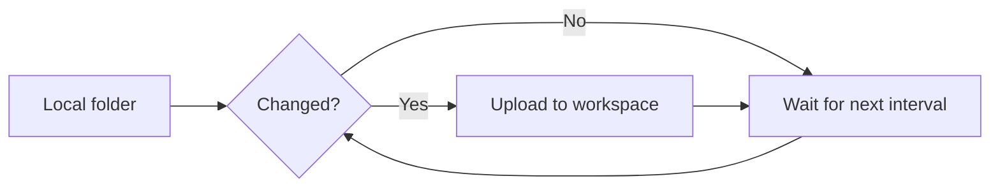
````

👀 O diagrama é renderizado, e **acompanha o modo claro/escuro** sozinho.

⚠️ **O build não valida Mermaid.** O Docusaurus renderiza os diagramas **no
navegador**, então um erro de sintaxe passa pelo `npm run build` sem reclamar e
vira uma caixa vermelha "Syntax error in text" na página. Confira sempre no
navegador depois de escrever um diagrama.

### O catálogo

Todos os exemplos abaixo foram testados no Mermaid 12, a versão que vem com o
`@docusaurus/theme-mermaid` 3.10. Estão em ordem de utilidade para documentação.

| Tipo | Use para |
|---|---|
| `flowchart` | Decisão, processo, fluxo de trabalho |
| `sequenceDiagram` | Conversa entre sistemas, ordem temporal |
| `erDiagram` | Modelo de dados, relação entre entidades |
| `stateDiagram-v2` | Máquina de estados, ciclo de vida |
| `gitGraph` | Estratégia de branch |
| `classDiagram` | Estrutura de objetos, API |
| `timeline` | Cronologia, histórico de versões |
| `gantt` | Cronograma com datas |
| `mindmap` | Mapa de conceitos |
| `journey` | Experiência do usuário, com nível de satisfação |
| `quadrantChart` | Priorização (esforço × valor) |
| `pie` | Proporção simples |
| `sankey-beta` | Volume que se divide entre caminhos |
| `xychart-beta` | Gráfico de barras ou linha |
| `block-beta` | Diagrama de blocos livre |
| `architecture-beta` | Arquitetura com ícones de serviço |

⚠️ Os quatro com sufixo `-beta` funcionam, mas a sintaxe **pode mudar em versão
menor** do Mermaid. Evite-os em documentação que você não revisa há meses.

#### sequenceDiagram — conversa entre sistemas

`````mdx
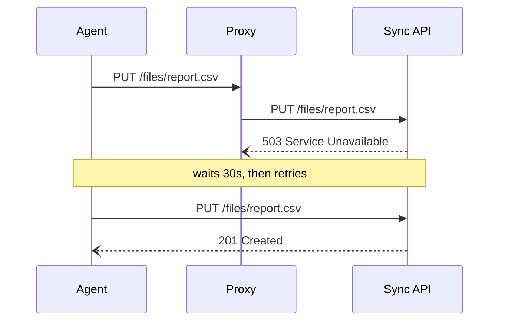
`````

`->>` é seta cheia (chamada), `--)` é tracejada (resposta). `Note over A,S`
escreve um comentário atravessando os participantes.

#### erDiagram — modelo de dados

`````mdx
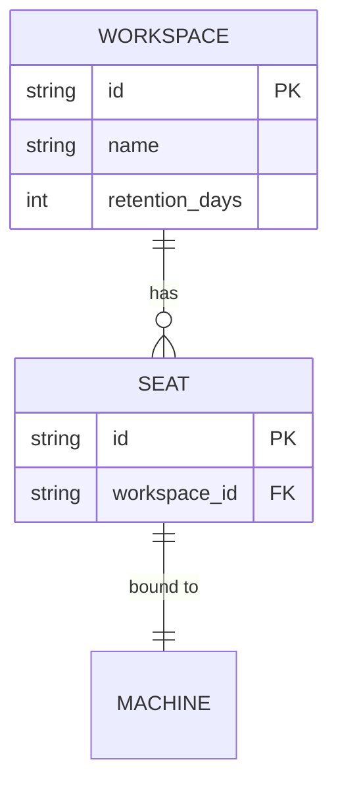
`````

A cardinalidade se lê nos dois sentidos: `||--o{` é "um para zero-ou-muitos".
`PK` e `FK` marcam chave primária e estrangeira.

#### stateDiagram-v2 — ciclo de vida

`````mdx
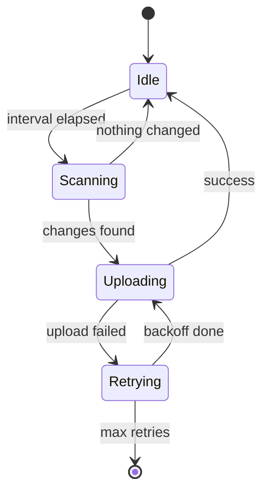
`````

`[*]` é o começo e o fim. O texto depois dos dois-pontos é a condição da transição.

#### gitGraph — estratégia de branch

`````mdx
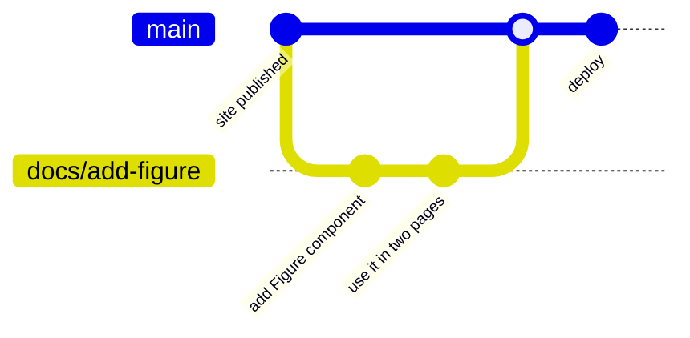
`````

💡 Este é literalmente o fluxo do
[Módulo 12](./12-build-and-deploy.md#passo-9--a-partir-de-agora-branch-e-pull-request).
Desenhar a própria estratégia de branch é um bom uso: a equipe vê a regra em vez
de ler a regra.

#### classDiagram — estrutura

`````mdx
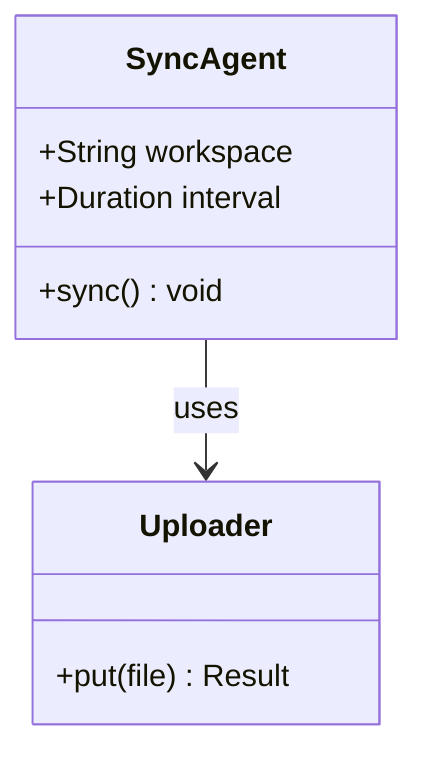
`````

`+` é público, `-` é privado. A seta com rótulo descreve a relação.

#### timeline — cronologia

`````mdx
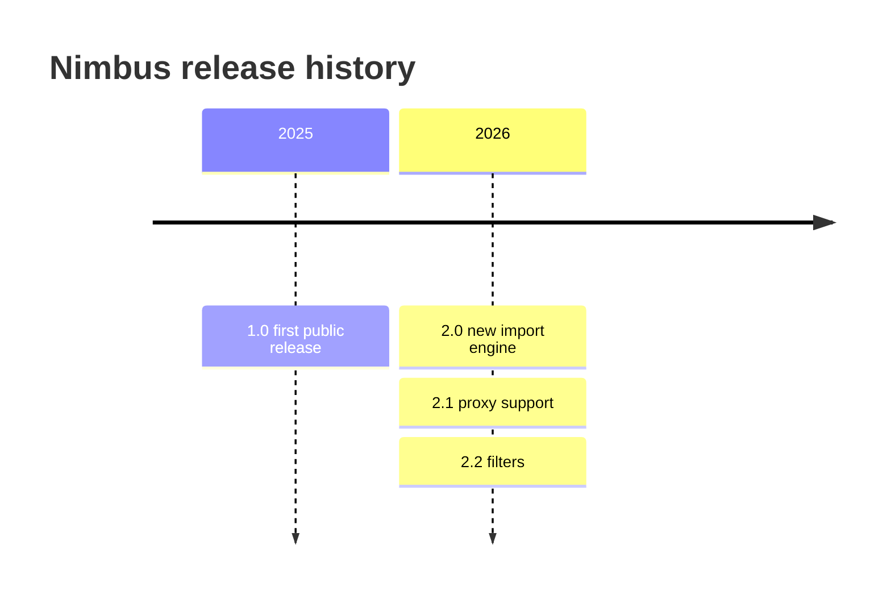
`````

Vários eventos no mesmo período são linhas extras começando com `:`.

#### gantt — cronograma

`````mdx
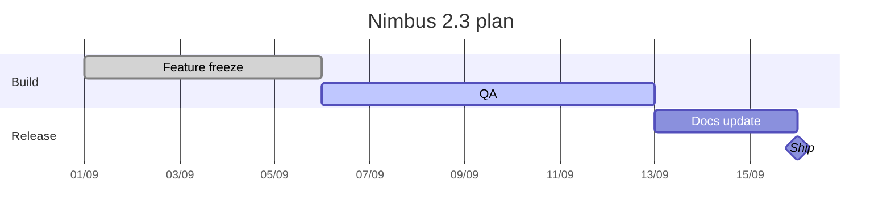
`````

`done`, `active` e `milestone` mudam a aparência da barra. `after a1` encadeia sem
você calcular datas.

⚠️ **O `gantt` é o mais frágil dos tipos.** Ele calcula a largura a partir do
container no momento da renderização, e em tela estreita chega a sair com largura
zero — invisível, sem erro nenhum. Se ele sumir no celular ou numa janela pequena,
é isso. Confira em mais de uma largura.

#### mindmap — mapa de conceitos

`````mdx
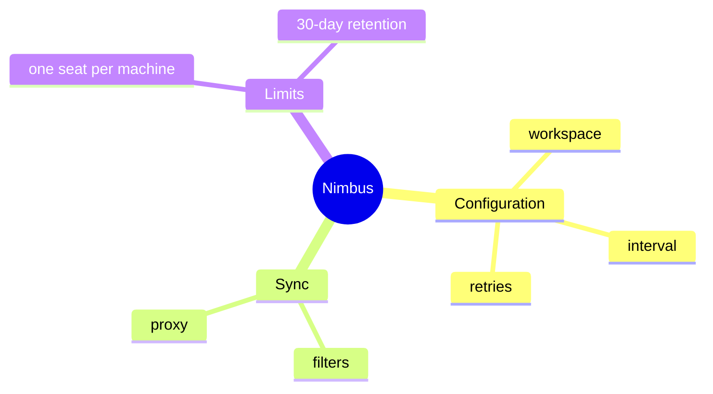
`````

A hierarquia vem só da **indentação** — não há setas. `root((texto))` desenha o
centro como círculo.

#### journey — experiência do usuário

`````mdx
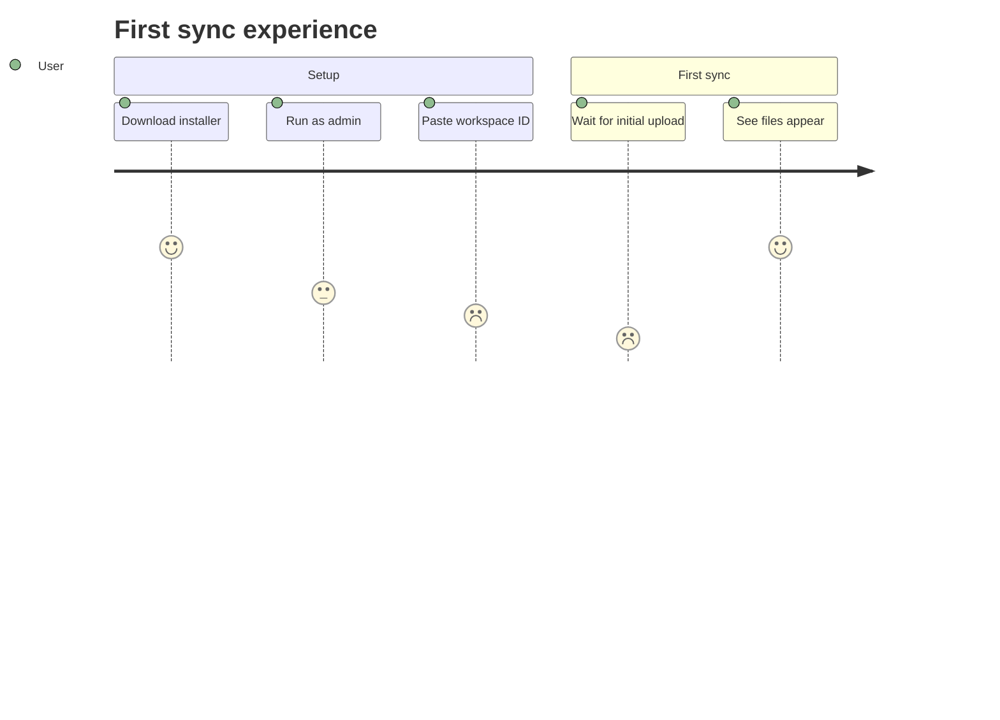
`````

O número de 1 a 5 é a satisfação naquele passo — é o que torna este diagrama útil:
ele mostra **onde dói**.

#### quadrantChart — priorização

`````mdx
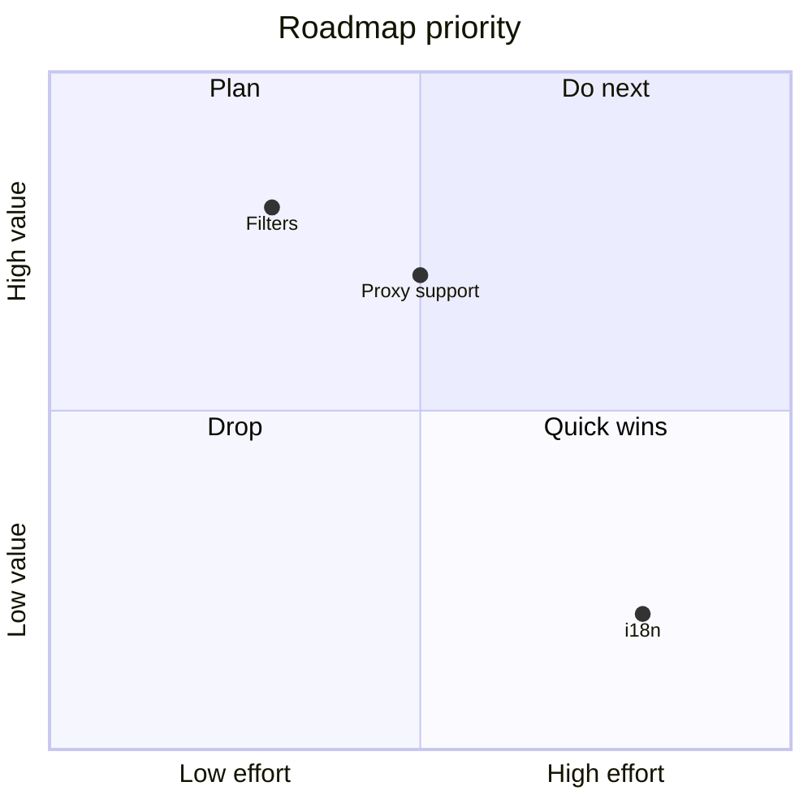
`````

Os pares `[x, y]` vão de 0 a 1.

#### pie — proporção

`````mdx
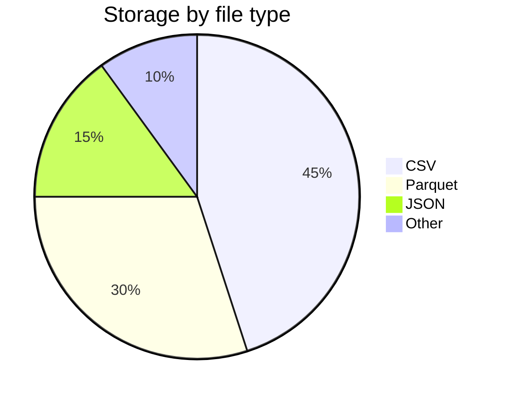
`````

#### sankey-beta — volume que se divide

`````mdx
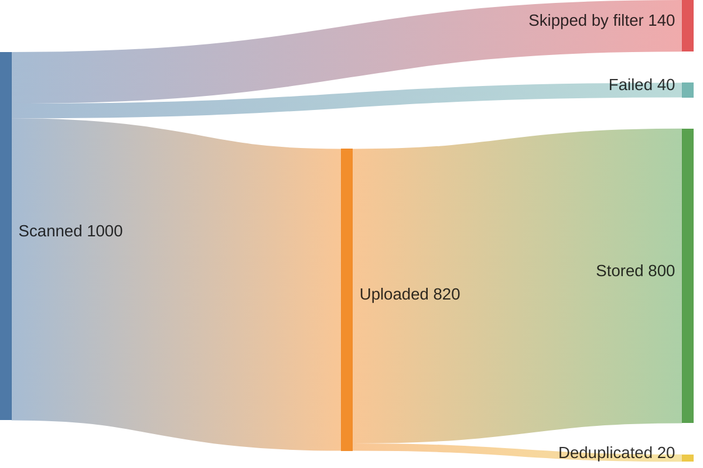
`````

Formato CSV: `origem,destino,valor`. Bom para mostrar onde o volume se perde num
pipeline.

#### xychart-beta — gráfico

`````mdx
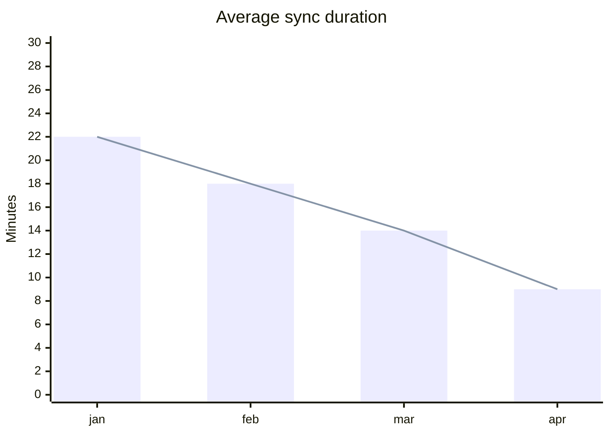
`````

Aceita `bar`, `line`, ou os dois sobrepostos.

#### block-beta — blocos livres

`````mdx
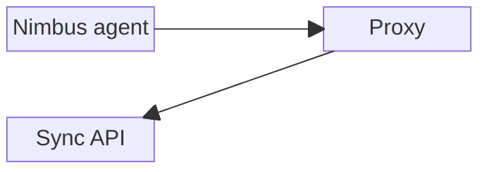
`````

`columns` define a grade; `space` deixa célula vazia.

#### architecture-beta — arquitetura com ícones

`````mdx
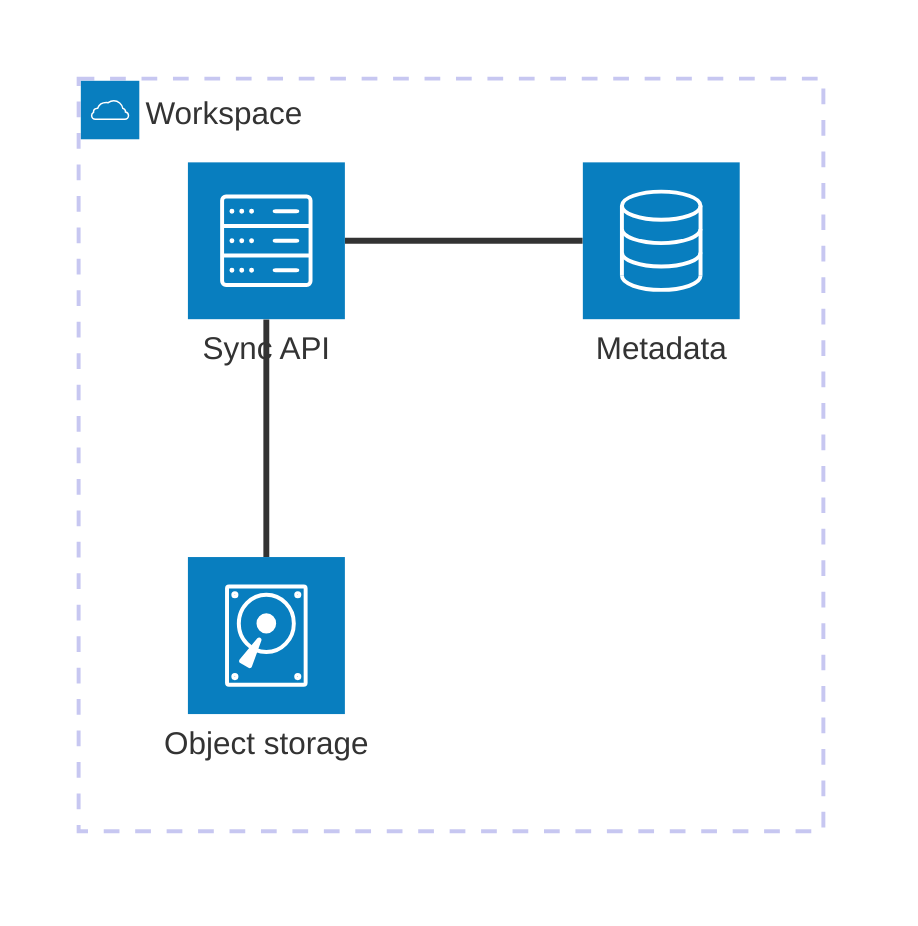
`````

Os ícones disponíveis são `cloud`, `server`, `database`, `disk` e `internet`.
`api:R -- L:db` liga a direita de um à esquerda do outro.

---

A sintaxe completa está em [mermaid.js.org](https://mermaid.js.org/), e o
[Mermaid Live Editor](https://mermaid.live/) mostra o resultado enquanto você
digita — é o melhor lugar para montar um diagrama antes de colar na página.

A vantagem sobre uma imagem: dá para revisar a mudança num diff do Git, e o
diagrama nunca fica desatualizado numa pasta separada. A desvantagem: controle
fino de layout é limitado — para um diagrama que precisa ficar exatamente de um
jeito, uma imagem ainda ganha.

---

## Passo 3 — Versionamento

Permite manter a documentação da versão 1.0 no ar enquanto você escreve a 2.0.

💻

```powershell
npm run docusaurus docs:version 1.0
```

👀 Foi criado:

```
versioned_docs/version-1.0/     ← cópia congelada de docs/
versioned_sidebars/             ← cópia da sidebar
versions.json                   ← ["1.0"]
```

A partir de agora: `docs/` é a versão em desenvolvimento ("Next"), e
`versioned_docs/version-1.0/` é a 1.0, congelada.

📄 Adicione o seletor em `themeConfig` → `navbar` → `items`:

```js
{type: 'docsVersionDropdown', position: 'right'},
```

📄 E configure qual versão é a padrão. ⚠️ Este `docs` é o de **`presets` → `classic`**,
o mesmo que tem o `sidebarPath` — **não** o do `themeConfig`:

```js
docs: {
  sidebarPath: './sidebars.js',   // já existe
  lastVersion: '1.0',
  versions: {
    current: {label: '2.0 (in development)', path: 'next'},
    '1.0': {label: '1.0 (stable)'},
  },
},
```

⚠️ **Pense antes de versionar.** Cada versão é uma cópia completa da pasta
`docs/`. Uma correção de erro de digitação que valha para todas as versões
precisa ser feita em todas as pastas — e ninguém faz. Na prática, as versões
antigas apodrecem.

Só versione quando pessoas realmente usam versões antigas do produto ao mesmo
tempo, e quando alguém tem o trabalho de manter as duas.

💻 Para este guia, **desfaça**:

```powershell
Remove-Item -Recurse -Force versioned_docs, versioned_sidebars, versions.json
```

E remova o `docsVersionDropdown` e o bloco `versions` do config.

---

## Passo 4 — Tradução (i18n)

📄 No **nível raiz** do config, ao lado de `title` e `url` — o bloco `i18n` já
existe no template, com um idioma só. Substitua ele inteiro:

```js
i18n: {
  defaultLocale: 'en',
  locales: ['en', 'pt-BR'],
  localeConfigs: {
    en: {label: 'English'},
    'pt-BR': {label: 'Português'},
  },
},
```

💻 Gere os arquivos de tradução **da interface** (os rótulos do tema: "Next",
"Edit this page", "On this page"):

```powershell
npm run write-translations -- --locale pt-BR
```

👀 Aparece `i18n/pt-BR/` com JSONs para você traduzir.

⚠️ **A chave que liga tudo é o `locales`.** Gerar a pasta `i18n/pt-BR` e pôr o
`localeDropdown` na navbar não basta: o seletor lista exatamente o que está no
array `locales`. Com `locales: ['en']` ele mostra só "English", e parece que o
recurso não funcionou.

⚠️ **E o `npm start` serve um idioma por vez.** O servidor de desenvolvimento não
monta os dois juntos — o seletor aparece, mas trocar de idioma leva a uma URL que
não existe em dev. Para ver os dois de verdade:

```powershell
npm run build
npm run serve
```

👀 O build gera `/` e `/pt-BR/` lado a lado. É o mesmo padrão da busca local e dos
redirects: recurso que só existe no site buildado.

O conteúdo em si é traduzido copiando os arquivos para a estrutura espelhada:

```
i18n/pt-BR/docusaurus-plugin-content-docs/current/installation.mdx
```

💻 Para trabalhar num idioma:

```powershell
npm start -- --locale pt-BR
```

📄 E o seletor em `themeConfig` → `navbar` → `items`:

```js
{type: 'localeDropdown', position: 'right'},
```

⚠️ **Mesmo alerta do versionamento, elevado.** Traduzir dobra o trabalho de
manutenção para sempre, e uma tradução desatualizada é pior que nenhuma —
o leitor confia e é enganado. Combine i18n com versionamento e você tem 4 cópias
de cada página.

⚠️ E note a assimetria com este guia: o **site** é em inglês, o **guia** é em
português. Isso é de propósito e não é i18n — são conteúdos diferentes, não
traduções um do outro. i18n é para quando a *mesma* página existe em dois
idiomas.

---

## Passo 5 — Plugins úteis

Plugins adicionam funcionalidade ao site. Quatro que valem conhecer, com o veredito
antes do detalhe:

| Plugin | Para quê | Vale a pena? |
|---|---|---|
| `@docusaurus/plugin-client-redirects` | Redireciona URLs antigas | ✅ Assim que você reorganizar a documentação uma vez |
| `@docusaurus/plugin-ideal-image` | Imagens responsivas e sob demanda | ✅ Se a documentação tem muitas capturas de tela |
| `docusaurus-plugin-openapi-docs` | Gera referência a partir de um OpenAPI | ✅ Se você documenta uma API REST |
| `@docusaurus/theme-live-codeblock` | Editor de código executável na página | ⚠️ Só se sua documentação for de **React** |

---

### 5.1 — Redirects

O mais útil dos quatro, e o primeiro que você vai precisar.

💻

```powershell
npm install @docusaurus/plugin-client-redirects
```

📄 No **nível raiz**, irmão de `presets` e `themes`:

```js
plugins: [
  [
    '@docusaurus/plugin-client-redirects',
    {
      redirects: [
        {from: '/docs/intro', to: '/docs/'},
      ],
    },
  ],
],
```

Esse redirect específico resolve um problema real do seu site: no Módulo 03 você
deu `slug: /` para o `intro.mdx`, e qualquer link antigo para `/docs/intro`
morreu. Agora ele volta a funcionar.

⚠️ **O `from` é uma URL, e URL começa com barra.** Escrever `from: 'docs/intro'`
derruba o build com:

```
"redirects[0].from" (docs/intro) is not a valid pathname.
Pathname should start with slash
```

⚠️ Este plugin só age no **build**. No `npm start` ele não faz nada — mesma
pegadinha da busca local.

💡 Para redirecionar muitas URLs de uma vez, existe `createRedirects`, que recebe
uma função em vez de uma lista. Útil quando você renomeia uma pasta inteira.

---

### 5.2 — Imagens responsivas (`plugin-ideal-image`)

Gera várias versões de cada imagem em tamanhos diferentes, serve a menor que
couber na tela, e mostra um borrão de baixa qualidade enquanto a definitiva
carrega.

💻

```powershell
npm install @docusaurus/plugin-ideal-image
```

📄 No **nível raiz**:

```js
plugins: [
  [
    '@docusaurus/plugin-ideal-image',
    {
      quality: 85,
      max: 1030,
      min: 640,
      steps: 2,
      disableInDev: false,
    },
  ],
],
```

📄 E na página, em vez do `` comum:

```jsx
import Image from '@theme/IdealImage';
import wizard from '@site/static/img/install-wizard.jpg';

<Image img={wizard} alt="The Nimbus install wizard" />
```

| Opção | O que faz |
|---|---|
| `quality` | Compressão JPEG. Padrão 85. |
| `min` / `max` / `steps` | Gera larguras entre o mínimo e o máximo. `steps: 2` = duas versões. |
| `sizes` | Alternativa: lista as larguras à mão, em vez de `min`/`max`/`steps` |
| `disableInDev` | Padrão `true` — o plugin **não age** em desenvolvimento |

⚠️ **Duas limitações que decidem se vale a pena:**

1. **Só PNG e JPG.** SVG e WebP passam direto. Se suas imagens são diagramas SVG,
   o plugin não faz nada por você.
2. **Desligado em desenvolvimento por padrão.** Você não vê o efeito no
   `npm start` a menos que ponha `disableInDev: false` — e aí vale usar a
   limitação de velocidade do navegador (`F12` → Network → Throttling) para
   enxergar o borrão de carregamento.

💡 **Quando pular:** documentação com cinco capturas de tela não precisa disso. O
plugin resolve um problema de volume — vale a partir de algumas dezenas de
imagens, ou quando os leitores estão em rede ruim.

---

### 5.3 — Referência de API a partir de OpenAPI

Se a sua equipe já mantém um arquivo OpenAPI (Swagger), este plugin gera as
páginas de referência a partir dele: uma página por endpoint, com parâmetros,
exemplos de requisição e resposta, e um "try it out".

⚠️ São **dois pacotes**, não um. O plugin gera o conteúdo; o tema desenha:

```powershell
npm install docusaurus-plugin-openapi-docs docusaurus-theme-openapi-docs
```

📄 No **nível raiz** — o plugin em `plugins`, o tema em `themes`:

```js
plugins: [
  [
    'docusaurus-plugin-openapi-docs',
    {
      id: 'api',
      docsPluginId: 'classic',
      config: {
        nimbus: {
          specPath: 'openapi/nimbus.yaml',
          outputDir: 'docs/api',
          sidebarOptions: {groupPathsBy: 'tag'},
        },
      },
    },
  ],
],
themes: ['docusaurus-theme-openapi-docs'],
```

💻 A geração é um comando separado, que você roda quando o spec muda:

```powershell
npm run docusaurus gen-api-docs nimbus
```

👀 Aparecem arquivos `.mdx` em `docs/api/`, um por endpoint, mais um
`sidebar.js` da seção.

⚠️ **O ponto que muda seu fluxo de trabalho:** esses arquivos são **gerados**.
Editá-los à mão é trabalho perdido — a próxima geração sobrescreve. Se precisar
acrescentar contexto, escreva numa página separada e linke.

⚠️ E lembre que é plugin **da comunidade** (versão 5.2.0, mantida pela Palo Alto
Networks). Vale a regra do Passo 1: antes de atualizar o Docusaurus, confira se a
versão dele acompanhou.

💡 **A decisão real** não é técnica: é se alguém mantém o OpenAPI atualizado. Se
o spec estiver velho, você passa a publicar documentação errada automaticamente —
o que é pior do que não ter.

---

### 5.4 — Código executável na página (`theme-live-codeblock`)

Transforma um bloco de código num editor: o leitor muda o código e vê o resultado
na hora.

💻

```powershell
npm install @docusaurus/theme-live-codeblock
```

📄 No **nível raiz**:

```js
themes: ['@docusaurus/theme-live-codeblock'],
```

📄 E o bloco ganha a palavra `live` depois da linguagem:

````mdx
```jsx live
function Counter() {
  const [n, setN] = React.useState(0);
  return <button onClick={() => setN(n + 1)}>Clicked {n} times</button>;
}
```
````

⚠️ **Leia isto antes de instalar: ele executa apenas React/JSX.**

Ele é construído sobre o [react-live](https://commerce.nearform.com/open-source/react-live/),
que roda JSX no navegador. Não executa Python, SQL, bash, PowerShell — nada além
de React. Um bloco ` ```python live ` não vira editor; continua um bloco comum.

E mesmo em React há restrição: *"It is not possible to import components directly
from the react-live code editor, you have to define available imports upfront."*
Por padrão, só o React está disponível dentro do editor.

| Sua documentação é de… | Este tema serve? |
|---|---|
| Biblioteca de componentes React | ✅ É exatamente o caso de uso |
| CLI, API, processo interno, pipeline de dados | ❌ Não faz nada |

💡 **Para documentação de CLI — a sua — pule.** O que você quer de um bloco de
código é `title=`, destaque de linha e botão de copiar, e isso o
[Módulo 05](./05-admonitions-and-code.md) já entregou sem instalar nada.

Se um dia precisar de código executável de verdade em outra linguagem, o caminho
é embutir um serviço externo (um iframe do Google Colab para Python, por exemplo)
— não este tema.

---

---

### 5.5 — Zoom nas imagens

O Docusaurus **não** tem zoom de imagem nativo — é a
[issue #10883](https://github.com/facebook/docusaurus/issues/10883), ainda aberta.
Sem ele, uma captura de tela grande fica reduzida à largura da coluna e o leitor
não tem como ver o detalhe.

💻

```powershell
npm install docusaurus-plugin-image-zoom
```

📄 São **dois lugares**. O plugin no **nível raiz**:

```js
plugins: [
  'docusaurus-plugin-image-zoom',
],
```

📄 E a configuração dentro do `themeConfig`, ao lado de `navbar` e `footer`:

```js
themeConfig: ({
  zoom: {
    selector: '.markdown img',
    background: {
      light: 'rgb(255, 255, 255)',
      dark: 'rgb(27, 27, 29)',
    },
  },
```

💻 Reinicie o `npm start` — registrar plugin não recarrega sozinho.

👀 Clique numa captura de tela. Ela cresce até caber na janela, sobre um fundo
escurecido. Clicar de novo, rolar a página ou apertar `Esc` fecha.

| Opção | O que faz |
|---|---|
| `selector` | Quais imagens ganham zoom. O padrão `.markdown img` pega tudo dentro do conteúdo, e deixa de fora logo e ícones da navbar. |
| `background` | A cor do fundo escurecido, por tema. Use a mesma do fundo da sua página no modo escuro. |
| `config` | Repassado direto para a biblioteca [medium-zoom](https://github.com/francoischalifour/medium-zoom) |

💡 O `background.dark` que o plugin traz de fábrica é um cinza (`rgb(50,50,50)`)
que destoa do fundo do Docusaurus. `rgb(27, 27, 29)` é a cor real do tema escuro —
vale trocar.

⚠️ **Zoom não substitui recortar.** Se o parágrafo fala de um filtro específico,
a captura deveria ser **do filtro**, não do painel inteiro. O zoom resolve o caso
em que a imagem precisa mesmo ser grande — uma visão geral, um diagrama denso —
não o hábito de dar print da tela toda.

⚠️ E ele pega imagem `.svg` também, inclusive as do `ThemedImage`. Se algum
diagrama seu não deve ampliar, restrinja o `selector` — por exemplo
`.markdown img:not(.no-zoom)` e marque as exceções.

#### Zoom ou `ideal-image`?

Os dois mexem em imagem, mas resolvem problemas opostos:

| | `plugin-ideal-image` | `docusaurus-plugin-image-zoom` |
|---|---|---|
| Resolve | **Banda** — baixa menos bytes | **Legibilidade** — deixa ver o detalhe |
| Formatos | Só PNG e JPG | Qualquer um, inclusive SVG |
| Aparece em dev? | Não, por padrão | Sim |
| Vale quando | Muitas imagens, rede ruim | Capturas densas: dashboard, painel, diagrama |

💡 **Em documentação interna, o segundo quase sempre ganha.** Na rede da empresa,
banda não costuma ser o gargalo — mas ninguém consegue ler os números de um
dashboard reduzido a 800px de largura.

---

## Passo 6 — Múltiplas instâncias de docs

Para separar conteúdos que não se misturam (ex.: "Guide" e "API"), com URLs e
versionamento independentes:

📄 Também no **nível raiz**:

```js
plugins: [
  [
    '@docusaurus/plugin-content-docs',
    {
      id: 'api',
      path: 'api',                 // the api/ folder at the root of website/
      routeBasePath: 'api',        // URLs under /api/...
      sidebarPath: './sidebars-api.js',
    },
  ],
],
```

E na navbar: `{type: 'docSidebar', docsPluginId: 'api', sidebarId: 'apiSidebar'}`.

> **Instância separada ou só uma sidebar a mais?** Se os dois conteúdos versionam
> juntos e compartilham links, uma segunda sidebar (Módulo 07, Passo 6) resolve e
> é muito mais simples. Instância separada é para quando eles têm ciclos de vida
> diferentes.

---

## Passo 7 — Código executando no navegador

Às vezes você precisa rodar um script em todas as páginas (analytics interno,
ajuste de comportamento). Use um *client module*:

📄 Crie `src/clientModules/analytics.js`:

```js
export function onRouteDidUpdate({location}) {
  console.log('Navigated to:', location.pathname);
}
```

📄 E registre no **nível raiz** do config:

```js
clientModules: ['./src/clientModules/analytics.js'],
```

⚠️ Esse código roda **no navegador**, não no build. Se você tentar usar `window`
ou `document` fora de um client module — direto num componente, por exemplo — o
build quebra com:

```
ReferenceError: window is not defined
```

Porque o Docusaurus renderiza as páginas no Node durante o build, e lá `window`
não existe. É a diferença entre gerar o HTML e executá-lo.

A solução padrão para componentes:

```jsx
import BrowserOnly from '@docusaurus/BrowserOnly';

<BrowserOnly>{() => <ComponentThatUsesWindow />}</BrowserOnly>
```

Repare que o filho é uma **função**, não um elemento. É o que adia a execução
para depois de o navegador assumir.

---

## Passo 8 — Se a documentação for interna

Boa parte deste módulo assume site público. Se a sua documentação vai viver só
dentro da empresa, algumas decisões mudam — e uma delas é séria.

### ⚠️ O repositório não pode ser público

Documentação interna carrega nome de sistema, estrutura de dados, captura de
dashboard com número real. Isso não vai para repositório público **nem por
engano**.

O fluxo do [Módulo 01](./01-git-and-github.md) é idêntico; muda só a
visibilidade:

- Repositório **privado** no GitHub, ou
- O Git da empresa — GitLab, Azure DevOps, Bitbucket Server

⚠️ E apagar um arquivo **não apaga o histórico**. Se uma captura com dado sensível
for parar num repositório público, ela continua acessível por commit antigo mesmo
depois de removida. Recuperar disso exige reescrever o histórico — e, se alguém já
clonou, não exige nada, porque já foi.

### O que sai da lista

| Recurso | Por quê |
|---|---|
| **GitHub Pages** | Repositório privado só tem Pages em plano pago, e o site publicado fica público mesmo assim |
| **Algolia DocSearch** | Exige site público e rastreável de fora |
| **`plugin-ideal-image`** | Banda raramente é gargalo em rede corporativa |
| **Cartão social, `sitemap.xml`, SEO** | Ninguém vai achar sua documentação no Google |

### O que passa a ser essencial

**Busca local** deixa de ser uma opção e vira a única —
[Passo 1, opção A](#opção-a--busca-local). E é a melhor para o caso mesmo: o
índice é gerado no build e roda no navegador, nenhum dado sai da rede.

**Zoom nas imagens** ([Passo 5.5](#55--zoom-nas-imagens)), pela legibilidade das
capturas de tela.

**O `description` do front matter** continua valendo — não por SEO, mas porque a
busca local usa.

### Onde o site vai morar

Aqui o [Módulo 12](./12-build-and-deploy.md) muda de forma. Em vez do GitHub
Actions publicando no Pages:

```powershell
npm run build
```

E o **conteúdo** de `build/` vai para a pasta pública do servidor — IIS, Apache,
Nginx, ou um compartilhamento de rede.

⚠️ E o `baseUrl` volta a ser o erro nº 1. Se o endereço final for
`http://intranet.empresa.com/documentacao/`:

```js
url: 'http://intranet.empresa.com',
baseUrl: '/documentacao/',
```

💻 Teste antes de entregar — o `serve` respeita o `baseUrl`:

```powershell
npm run build
npm run serve
```

👀 Ele abre em `http://localhost:3000/documentacao/`. Se o CSS não carregar ali,
não vai carregar na intranet.

💡 **Pergunte à infraestrutura antes de assumir cópia manual.** GitLab e Azure
DevOps internos têm Pages próprio e CI. Se a empresa usa um deles, você
reaproveita a ideia inteira do Módulo 12 — muda só o arquivo de workflow, e a
publicação continua automática a cada push.

---

## Passo 9 — Registrar no Git

💻

```powershell
cd ..
git add .
git commit -m "feat: add local search, Mermaid diagrams and URL redirects"
git push
cd website
```

---

## ✅ Checkpoint

- [x] Busca funcionando (lembre: precisa de `npm run build` + `npm run serve`)
- [x] Pelo menos um diagrama Mermaid renderizando, e trocando com o tema
- [x] Um único array `themes`, com os dois plugins dentro
- [x] Um redirect de `/docs/intro` para `/docs/`
- [x] Você experimentou versionamento e **desfez**
- [x] Você sabe explicar por que versionamento e i18n têm custo permanente
- [x] `npm run build` passa
- [x] Commit feito

---

## 🎯 Exercício

**1. Busca, do zero ao teste**

Instale a busca local, builde, sirva, e pesquise por três palavras:

| Busca      | Deve encontrar                                              |
| ---------- | ----------------------------------------------------------- |
| `keychain` | Duas páginas: a de configuração básica e a de referência    |
| `nimbus`   | Praticamente tudo                                           |
| `xyzzy`    | Nada — e a tela de "sem resultados" tem que aparecer bonita |

**2. Dois diagramas**

📄 Em `docs/installation.mdx`, um `flowchart` do processo de instalação: baixar →
executar → reiniciar → verificar, com um losango de decisão em "instalou como
administrador?".

📄 Em `docs/configuration/advanced-setup.mdx`, um `sequenceDiagram` mostrando o
agente, o proxy e a API numa tentativa de upload com um retry.

Esqueleto para o segundo:

````mdx
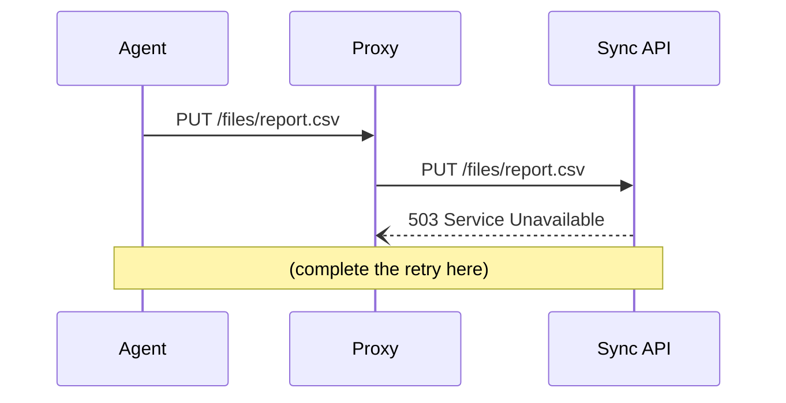
````

**3. Redirects de verdade**

📄 Renomeie `docs/reference.mdx` para `docs/syntax-reference.mdx`.

💻 Rode `npm run build`.

👀 Ele **falha**, listando cada link que apontava para o nome antigo — inclusive
os do rodapé e do `sidebars.js`. Conserte todos.

⚠️ **Se você manteve o versionamento do Passo 3, o build vai passar.** Não é
sorte: o `versioned_docs/version-1.0/` guarda uma cópia congelada com o nome
antigo, e como `lastVersion` aponta para ela, os links continuam resolvendo — só
que para a página velha. O `onBrokenLinks` não tem o que denunciar.

É o custo do versionamento aparecendo na prática: renomear conteúdo deixa de ser
uma operação de um arquivo só. Para fazer este exercício inteiro, desligue o
versionamento antes (apague `versions.json`, `versioned_docs/` e
`versioned_sidebars/`) e religue depois, se quiser mantê-lo de vitrine.

📄 Depois adicione o redirect de `/docs/reference` para `/docs/syntax-reference`,
builde, sirva, e acesse a URL antiga.

**4. Decida, e escreva a decisão**

📄 No `guide/NOTES.md`, responda em duas linhas cada:

- Em que situação real você ligaria versionamento neste site?
- Em que situação você traduziria a documentação do Nimbus?

Se a resposta for "nenhuma", ótimo — a resposta certa é quase sempre essa, e é
por isso que o passo existe.

**5. Commite**

**Como saber que deu certo:**

- A busca encontra `keychain` e lista as duas páginas que falam de credenciais
- Os dois diagramas mudam de cor ao trocar o tema
- `http://localhost:3000/docs/reference` (no `npm run serve`) redireciona para o
  novo endereço
- `npm run build` passa, sem avisos

---

## 📌 O que você aprendeu

Busca é a primeira funcionalidade que falta em qualquer documentação, e a local
só aparece no build. Mermaid mantém diagramas versionados junto com o texto.
Redirects são o que faz reorganizar a documentação sair barato. Versionamento e
tradução são poderosos e caros — adote quando houver demanda real, não por
precaução.

➡️ Próximo: [Módulo 12 — Build e publicação](./12-build-and-deploy.md)
