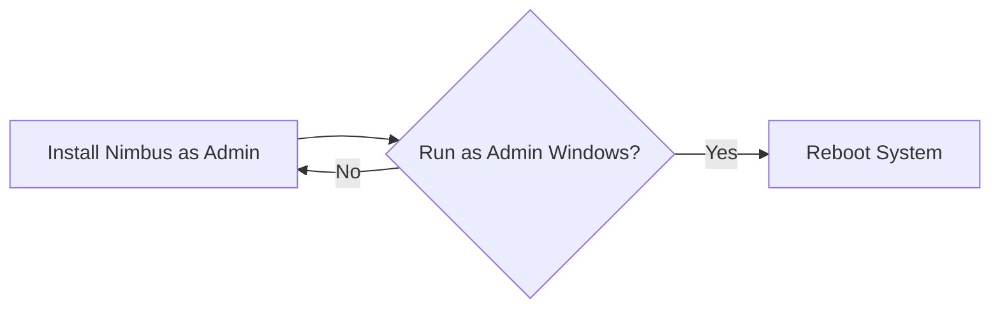

import Tabs from '@theme/Tabs';
import TabItem from '@theme/TabItem';
import ThemedImage from '@theme/ThemedImage';
import useBaseUrl from '@docusaurus/useBaseUrl';
import Figure from '@site/src/components/Figure';


<ThemedImage
    sources={{
        light: useBaseUrl('/img/undraw_docusaurus_mountain.svg'),
        dark: useBaseUrl('/img/undraw_docusaurus_react.svg'),
    }}
    alt= "Themed Image Example"
    style={{width: '50%'}}
/>

{/* Without Function*/}
{/*<figure>
    
    <figcaption style={{textAlign: 'center', fontSize: '.85rem', opacity: '0.7' , width: '50%'}}>
        Install Wizard Image
    </figcaption>
</figure>*/}

{/* With Function */}
<Figure
    src="/img/install-wizard.jpg"
    alt= "The Nimbus install wizard, first screen"
    caption="Figure 1 — the installer asks for your workspace ID."
    width="500px"/>

How to get Nimbus running on your machine.

:::info

The installation takes ~5 minutes and requires a reboot.

:::

| Platform | Status | Notes |
|---|:---:|---|
| Windows 11 | ✅ | Fully supported |
| Windows 10 | ⚠️ | Supported until January 2027 |
| macOS 14+ | ✅ | Fully supported |
| macOS 13 | ⚠️ | Security fixes only |
| Ubuntu 22.04+ | ✅ | Fully supported |
| Linux, glibc < 2.31 | ❌ | Not supported |

<Tabs groupId="operating-system" queryString="os">
    <TabItem value="windows" label="Windows" default>

    |Requirements|
    | :---: |
    | Windows 10 or later |
    | 8 GB of RAM |
    | Network access to your Nimbus workspace |

    ---

    #### <svg xmlns="http://www.w3.org/2000/svg" width="24" height="24" viewBox="0 0 24 24" fill="none" stroke="currentColor" stroke-width="2" stroke-linecap="round" stroke-linejoin="round" className="lucide lucide-waypoints"> <path d="m10.586 5.414-5.172 5.172"/> <path d="m18.586 13.414-5.172 5.172"/> <path d="M6 12h12"/> <circle cx="12" cy="20" r="2"/> <circle cx="12" cy="4" r="2"/> <circle cx="20" cy="12" r="2"/> <circle cx="4" cy="12" r="2"/> </svg> Steps {/* #steps-windows */}

    1. Run the command below on PowerShell

        :::warning
        Run it with administrator privileges
        :::

        ```powershell title="PowerShell" showLineNumbers
        winget install Nimbus.CLI
        ```

    2. Restart your machine.
    3. Confirm the install by running:

        ```powershell title="PowerShell" showLineNumbers
        nimbus --version
        ```
    4. Configure your environment

        ```yaml title="~/.nimbus/config.yml" showLineNumbers
        # highlight-next-line
        workspace: replace-with-your-workspace-id
        interval: 15m
        retries: 3
        ```


    </TabItem>

    <TabItem value="macos" label="macOS">

    |Requirements|
    | :---: |
    | macOs 13 or later |
    | 8 GB of RAM |
    | Network access to your Nimbus workspace |

    ---
    #### <svg xmlns="http://www.w3.org/2000/svg" width="24" height="24" viewBox="0 0 24 24" fill="none" stroke="currentColor" stroke-width="2" stroke-linecap="round" stroke-linejoin="round" className="lucide lucide-waypoints"> <path d="m10.586 5.414-5.172 5.172"/> <path d="m18.586 13.414-5.172 5.172"/> <path d="M6 12h12"/> <circle cx="12" cy="20" r="2"/> <circle cx="12" cy="4" r="2"/> <circle cx="20" cy="12" r="2"/> <circle cx="4" cy="12" r="2"/> </svg> Steps {/* #steps-macos */}

    1. Run the command below on Terminal

        ```bash title="Terminal" showLineNumbers
        brew install nimbus
        ```

    2. Restart your machine.
    3. Confirm the install by running:

        ```bash title="Terminal" showLineNumbers
        nimbus --version
        ```
    4. Configure your environment

        ```yaml title="~/.nimbus/config.yml" showLineNumbers
        # highlight-next-line
        workspace: replace-with-your-workspace-id
        interval: 15m
        retries: 3
        ```

    </TabItem>

    <TabItem value="linux" label="Linux">

    |Requirements|
    | :---: |
    | any linux with glibc 2.31+ |
    | 8 GB of RAM |
    | Network access to your Nimbus workspace |

    ---
    #### <svg xmlns="http://www.w3.org/2000/svg" width="24" height="24" viewBox="0 0 24 24" fill="none" stroke="currentColor" stroke-width="2" stroke-linecap="round" stroke-linejoin="round" className="lucide lucide-waypoints"> <path d="m10.586 5.414-5.172 5.172"/> <path d="m18.586 13.414-5.172 5.172"/> <path d="M6 12h12"/> <circle cx="12" cy="20" r="2"/> <circle cx="12" cy="4" r="2"/> <circle cx="20" cy="12" r="2"/> <circle cx="4" cy="12" r="2"/> </svg> Steps {/* #steps-linux */}
    

    1. Run the command below on Terminal

        ```bash title="Terminal" showLineNumbers
        curl -fsSL https://get.nimbus.example/install.sh | sh
        ```

    2. Restart your machine.
    3. Confirm the install by running:

        ```bash title="Terminal" showLineNumbers
        nimbus --version
        ```
    4. Configure your environment

        ```yaml title="~/.nimbus/config.yml" showLineNumbers
        # highlight-next-line
        workspace: replace-with-your-workspace-id
        interval: 15m
        retries: 3
        ```

    </TabItem>
</Tabs>


## Flowchart Installation



:::tip[This command diagnoses the setup for you!]

    ```powershell title="PowerShell or Terminal" showLineNumbers
    nimbus doctor
    ```

:::