import Tabs from '@theme/Tabs';
import TabItem from '@theme/TabItem';
import ThemedImage from '@theme/ThemedImage';
import useBaseUrl from '@docusaurus/useBaseUrl';
import Logo from '@site/static/img/logo.svg';
import {FiGithub, FiPackage, FiChrome, FiUmbrella} from 'react-icons/fi';
import Figure from '@site/src/components/Figure'


A living page where each formatting feature is show in use.

## Headings

### A subsection

#### A detail

### Installing on Windows {/* #windows-install */}

## Text Formatting

**bold**, _italic_, **_both_**, ~~strikethrough~~, `inline code`.

One Line.
Another line - same paragraph!

A blank line starts a new paragraph.

Or end the line with a backslash: \
like this.

## Lists

- A simple item
- Another item
    - Nested (indent with 2 spaces)
        - Even deeper

1. First
2. Second
    1. Numbered sub-item
3. Third

- [x] Completed task
- [ ] Pending task

1. Install the dependencies

    ```powershell
    npm install
    ```

2. Start the project.

## Quotes

> A quote.
> 
> With two paragraphs.

___

## Tables

| Command | What it does | How often |
| --- | --- | :---: |
| `nimbus sync` | Syncs the workspace now | Daily |
| `nimbus status` | Shows pending changes | Often |
| `nimbus doctor` | Diagnoses the local setup | When something breaks |

## Links

1. [File path](./installation.mdx)
2. [Site URL](/docs/installation)
3. [External](https://docusaurus.io)

## Footnotes

Nimbus stores credentials in the system keychain[^1].

[^1]: Keychain on macOs, Credential Manager on Windows, and Secret Service on Linux.

## Collapsible blocks

<details>
    <summary>What to do when port 3000 is already in use</summary>

    Start the server on another port:

    ```powershell
    npm start -- --port 3001
    ```

</details>

{/* This does not show up on the site */}


## Admonitions

:::note
A neutral remark. Gray
:::

:::tip
A useful, opctional shortcut. Green.
:::

:::info
Extra content. Blue.
:::

:::warning
Requires attention before moving on. Yellow
:::

:::danger
Destructive action or seriou error. Red
:::

### When Use It

| Type | When to Use |
| :---: | --- |
| `note` | Detail that never change what the person does. |
| `tip` | A shortcut that can be used to make the task easier. |
| `info` | Context that help to understand, but is not required. |
| `warning` | If ignore it, something will break. |
| `danger` | If ignore it, will lose data or something will be destroyed. |


:::tip[A shortcut that saves time]
`npm run clear` wipes the cache. It is the first thing to try when the site behaves strangely after a config change.
:::


::::info[Full upgrade procedure]

1. Stop the agent:

    ```powershell
    nimbus stop
    ```

:::warning[Run as Administrator]
The installer writes to `Program Files` and fails silently otherwise.
:::

2. Run the installer.

::::


```powershell
nimbus sync --force
```

```python
print("Hello World")
```

```yaml title="~/.nimbus/config.yml"
workspace: acme-prod
interval: 15m
retries: 3
```

```yaml title="~/.nimbus/config.yml"
workspace: acme-prod
# highlight-next-line
interval: 15m
# highlight-start
proxy:
    url: http://proxy.acme.interval:8080
# highlight-end
```

```python {2,4,6}
def process(items):
    total = 0
    for item in items:
        if item.active:
            total += item.value
    return total
```

```js showLineNumbers
function sum(a,b) {
    return a + b
}
```

## Tabs

<Tabs groupId="operating-system">
    <TabItem value="windows" label="Windows" default>

    ```powershell
    winget install Nimbus.CLI
    ```

    </TabItem>

    <TabItem value="macos" label="MacOS">
    
    ```bash
    brew install nimbus
    ```

    </TabItem>

    <TabItem value="linux" label="Linux">
    
    ```bash
    curl -fsSL https://get.nimbus.example/install.sh | sh
    ```
    
    </TabItem>
</Tabs>

## Images


{/*Not Critic Image*/}


{/*Critic Image*/}


<ThemedImage
    alt="Illustration that follows the theme"
    sources={{
        light: useBaseUrl('/img/undraw_docusaurus_mountain.svg'),
        dark: useBaseUrl('/img/undraw_docusaurus_react.svg'),
    }}
    style={{width: 320}}
/>

{/* Without function */}
<figure style={{margin:0}}>
    
    <figcaption style={{textAlign: 'center', fontSize: '.85rem', opacity: 0.7}}>
        Figure 1 - How a sync round-trip works.
    </figcaption>
</figure>

{/* With Function */}
<Figure
    src = "/img/nimbus-dashboard.jpg"
    alt = "Sync architeture"
    caption = "Figure 1 - How a sync round-trip works"
    width = "400px"
/>

## Platform support

| Platform | Status | Notes |
| --- | :---: | --- |
| Windows 11 | ✅ | Fully supported |
| Windows 10 | ⚠️ | Supported until January 2027 |
| macOS 13+ | ✅ | Fully Supported |
| Linux (glibc < 2.31) | ❌ | Not supported |
| FreeBSD | 🚧 | In Progress |


<Logo Style={{width: 32, heigth: 32}} /> 


<svg
    width= "24" height= "24" viewbox= "0 0 24 24"
    fill= "none" stroke="currentColor" strokeWidth="2"
    strokeLinecap="round" strokeLineJoin="round">
    <path d="M12 2L2 7l10 5 10-5-10-5z" />
    <path d="M2 17l10 5 10-5" />
</svg>


<svg 
    xmlns="http://www.w3.org/2000/svg" width="24" height="24" 
    viewBox="0 0 24 24" fill="none" stroke="currentColor" 
    stroke-width="2" stroke-linecap="round" stroke-linejoin="round" 
    class="lucide lucide-calendar-days">
    <path d="M8 2v3"/>
    <path d="M16 2v3"/>
    <rect x="3" y="3" width="18" height="18" rx="2"/>
    <path d="M3 9h18"/>
    <path d="M8 13h.01"/>
    <path d="M12 13h.01"/>
    <path d="M16 13h.01"/>
    <path d="M8 17h.01"/>
    <path d="M12 17h.01"/>
    <path d="M16 17h.01"/>
</svg>

<svg 
    xmlns="http://www.w3.org/2000/svg" width="24" height="24" viewBox="0 0 24 24" 
    fill="none" stroke="currentColor" stroke-width="2" stroke-linecap="round" 
    stroke-linejoin="round" class="lucide lucide-refresh-ccw">
    <path d="M21 12a9 9 0 0 0-9-9 9.75 9.75 0 0 0-6.74 2.74L3 8"/>
    <path d="M3 3v5h5"/>
    <path d="M3 12a9 9 0 0 0 9 9 9.75 9.75 0 0 0 6.74-2.74L21 16"/>
    <path d="M16 16h5v5"/>
</svg>

<FiGithub size={20} /> Repository

<FiChrome size={20}/> Chrome

<FiUmbrella size={20} /> Umbrella


## Layout

<div className="row">
    <div className="col col--4">
        <div className="card padding--md">
            <h4>First</h4>
            <p>One third of the width.</p>
        </div>
    </div>
    <div className="col col--4">
        <div className="card padding--md">
            <h4>Second</h4>
            <p>Another third.</p>
        </div>
    </div>
    <div className="col col--4">
        <div className="card padding--md">
            <h4>Third</h4>
            <p>The last third.</p>
        </div>
    </div>
</div>

<div className="margin-top--lg padding--md margin--bottom-sm">
</div>

<a className='button button--primary button--md' href='/docs/installation'>
Get Started
</a>

<span className="badge badge--primary">v2.0</span>
<span className="badge badge--warning">beta</span>
<span className="badge badge--danger">deprecated</span>

## Mermaid

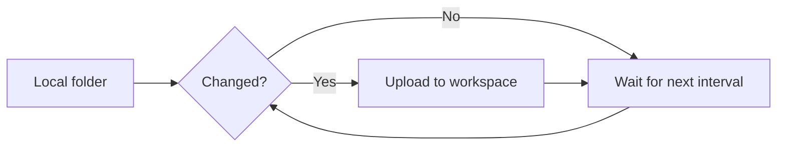

#### sequenceDiagram — conversa entre sistemas

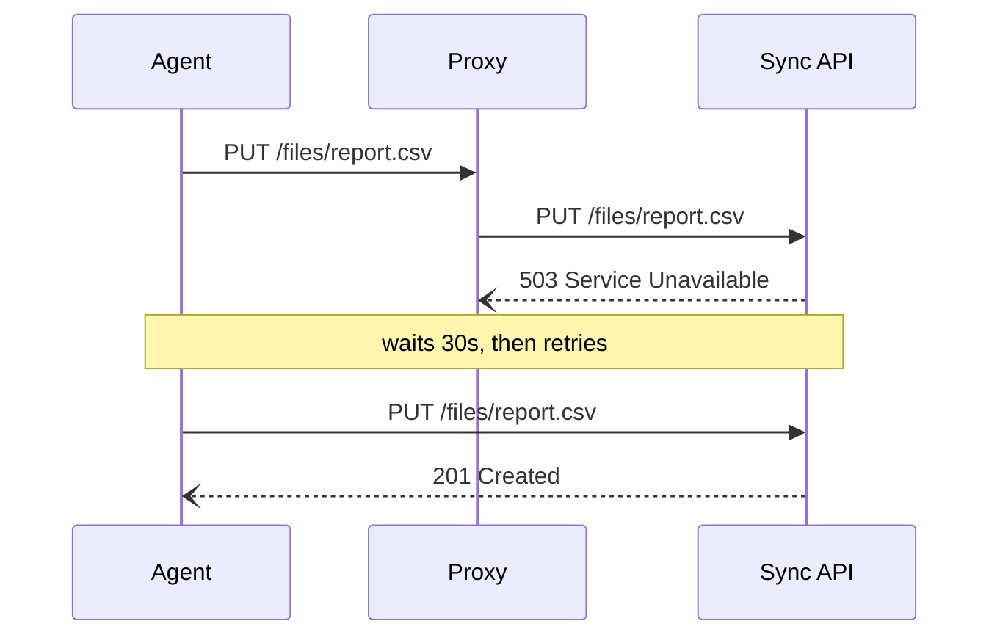

#### erDiagram — modelo de dados

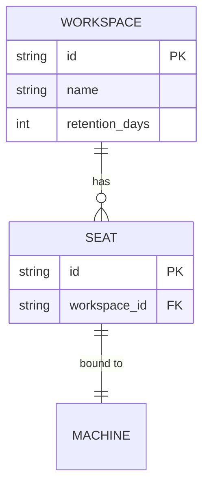

#### stateDiagram-v2 — ciclo de vida

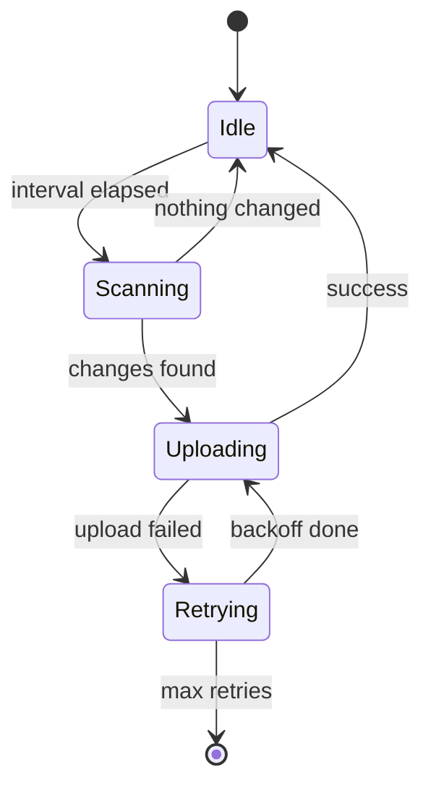

#### gitGraph — estratégia de branch

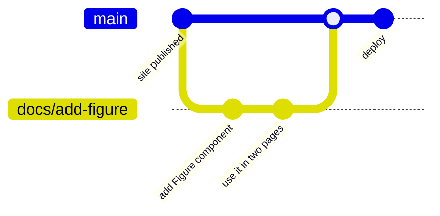

#### classDiagram — estrutura

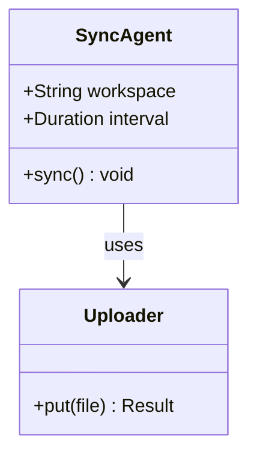

#### timeline — cronologia

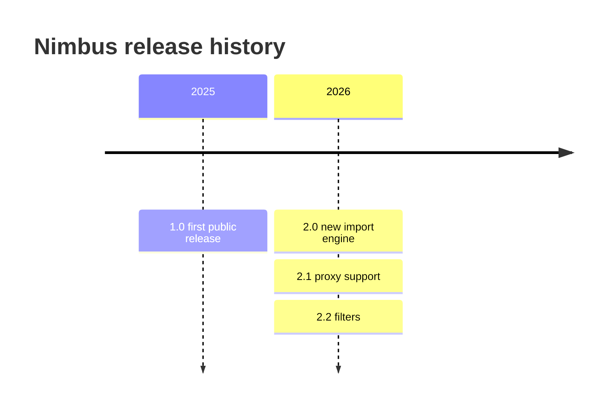

#### gantt — cronograma

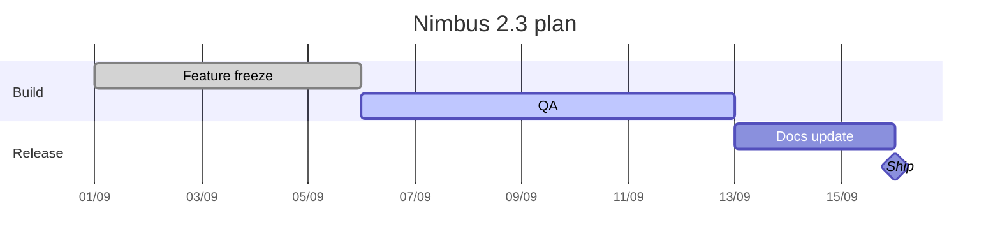

#### mindmap — mapa de conceitos

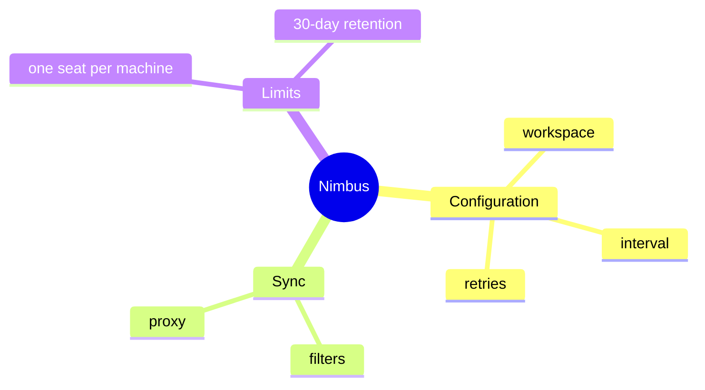

#### journey — experiência do usuário

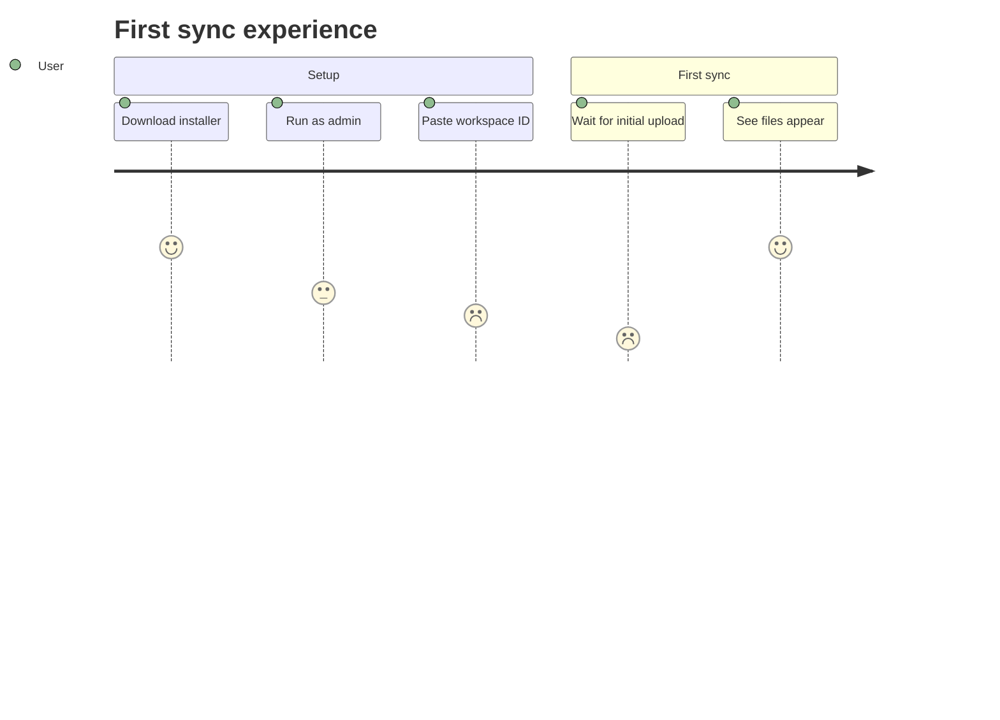

#### quadrantChart — priorização

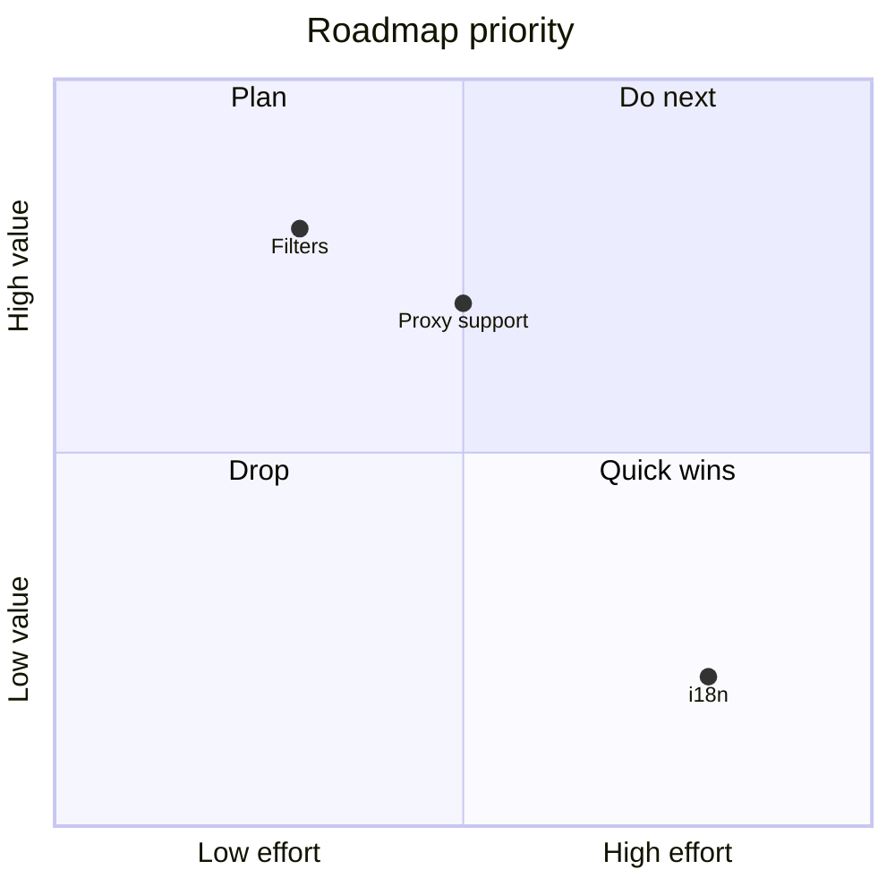

#### pie — proporção

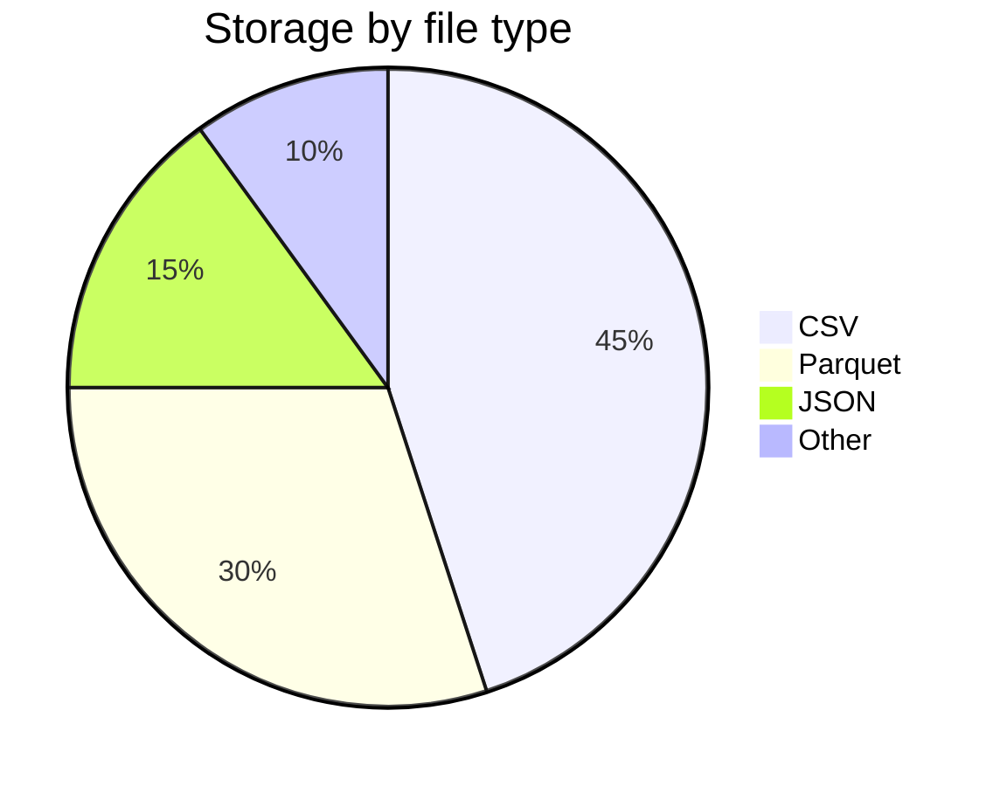

#### sankey-beta — volume que se divide

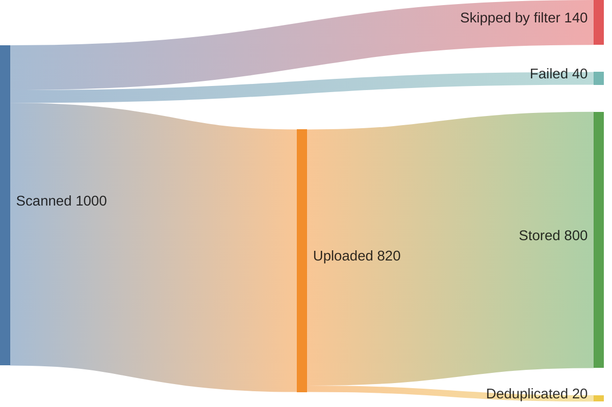

#### xychart-beta — gráfico

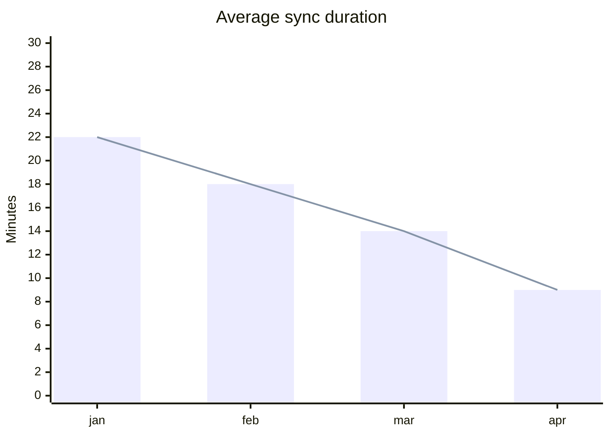

#### block-beta — blocos livres

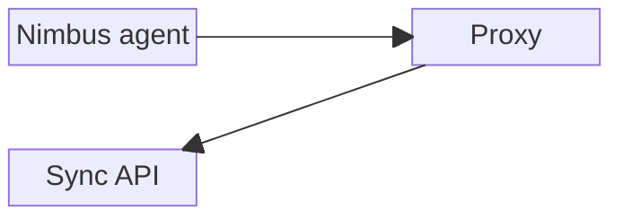

#### architecture-beta — arquitetura com ícones

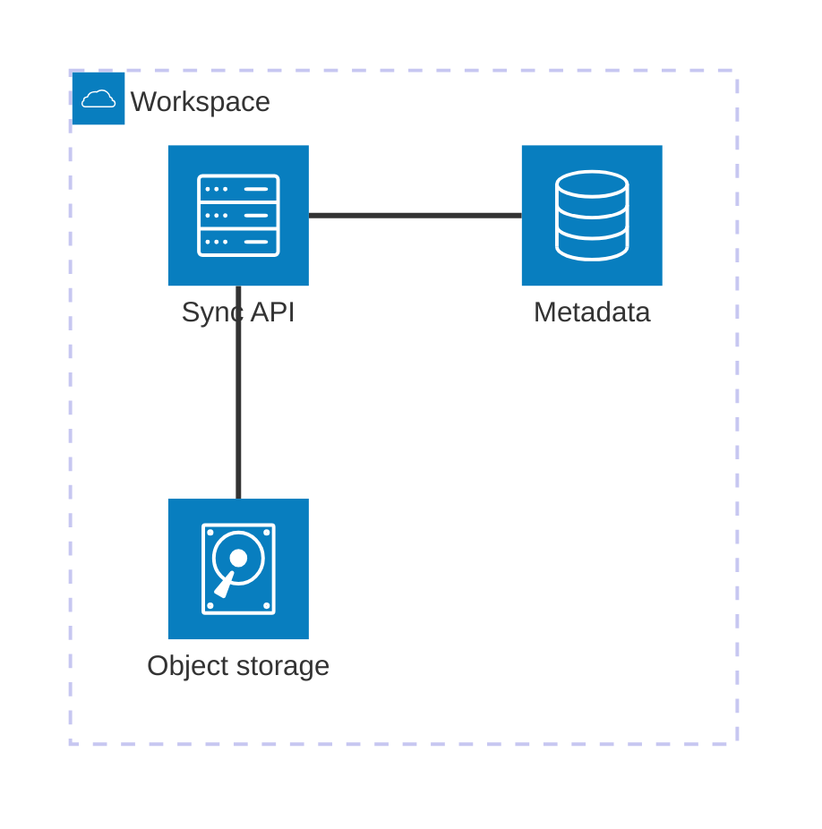

